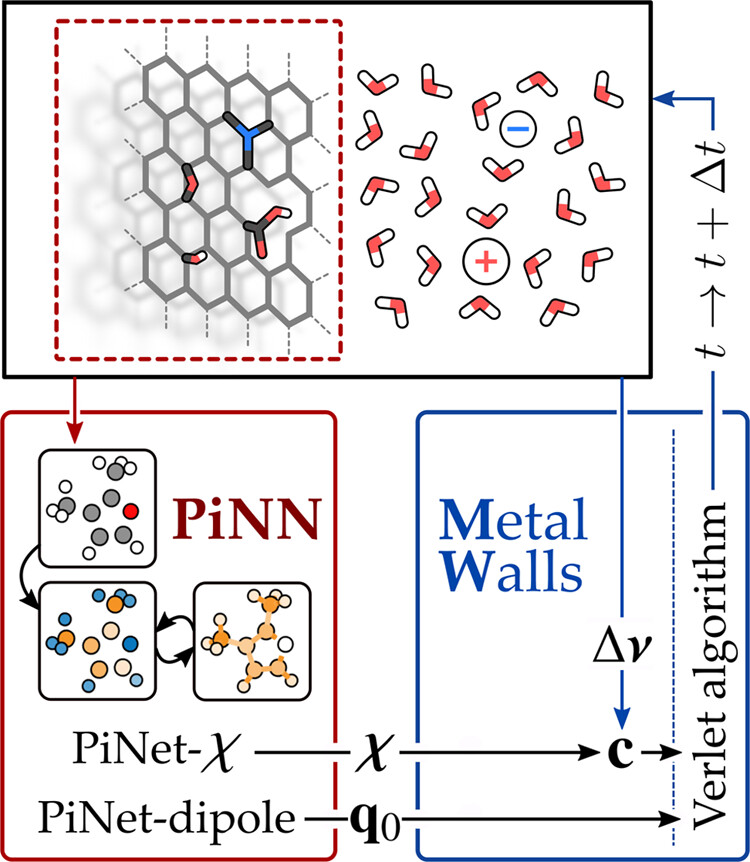

# PiNNwall

PiNNwall enables the integration of a machine learned charge response kernel (CRK) predicted by PiNN[^1] with the Metalwalls MD simulation software[^2]. A scheme illustrating the concept behind PiNNwall is shown in Figure 1. PiNNwall was first introduced in the following work[^3], and later upgraded through the introduction of higher-order tensorial features in PiNN[^4]. A more in-depth tutorial illustrating the application of PiNNwall to a hydroxylated electrode can be found in the *examples* part of the documentation.

  

**Figure 1.** Flowchart of the PiNNwall interface. The electrode structure is passed from MetalWalls to PiNN, which computes the charge response kernel χ using PiNet-χ and the base charges of the electrode atoms q0 using PiNet-dipole. From the electrolyte configuration and the electrostatic boundary conditions, MetalWalls computes the potential on the electrode sites Δν. By combining χ and Δν, MetalWalls generates the response charges c at electrode sites, computes forces, and propagates the dynamics of the system using, for example, the Verlet algorithm.

[^1]: [PiNN GitHub repository](https://github.com/Teoroo-CMC/PiNN)
[^2]: [Metalwalls repository](https://gitlab.com/ampere2/metalwalls)
[^3]: Dufils, T., Knijff, L., Shao, Y., & Zhang, C. (2023). PiNNwall: Heterogeneous electrode models from integrating machine learning and atomistic simulation. *Journal of Chemical Theory and Computation, 19*(15), 5199-5209.
[^4]: Li, J., Knijff, L., Zhang, Z. Y., Andersson, L., & Zhang, C. (2025). PiNN: Equivariant Neural Network Suite for Modeling Electrochemical Systems. *Journal of Chemical Theory and Computation, 21*(3), 1382-1395.

