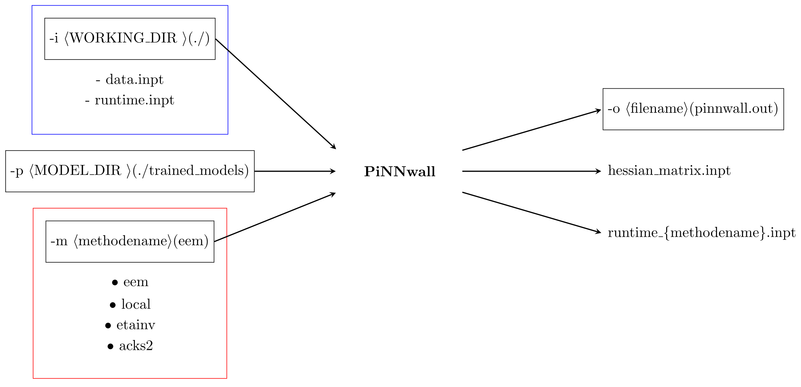

# Usage

PiNNwall enables the integration of a machine learned charge response kernel (CRK) predicted by PiNN[^1] with the Metalwalls MD simulation software[^2]. PiNNwall was first introduced in the following work[^3], and later upgraded through the introduction of higher-order tensorial features in PiNN[^4]. A more in-depth example illustrating the application of PiNNwall to a hydroxylated electrode can be found in the *tutorial* part of the documentation.

## Preparation

PiNNwall predicts the Hessian Matrix for Metalwalls[^2] using machine learning (ML)-models trained using PiNN[^1]. In order to run PiNNwall, one needs to have PiNN installed first.

Before prediction, one needs to have constructed the input files of Metalwalls, namely the *data.inpt* and *runtime.inpt*, which you will use to run the Metalwalls simulations. For the best performance of PiNNwall, base charges need for the electrode atoms need to be set in the *data.inpt* file. Depending on the electrode structure, these could directly be taken from the PiNNwall papers, predicted using PiNN, taken from force-field parameters or computed using a population analysis method.

Then, clone this repo to get the scripts and the ML-models that will be used in predicting the CRK.

After executing PiNNwall, it will generate a *hessian_matrix.inpt* to be used by Metalwalls which contains the machine learned CRK. This *hessian_matrix.inpt* file in Metalwalls traditionally contains the inverse of the hardness kernel which is analogous in concept to the CRK predicted here. Both can be used in the same way to obtain response charges on the electrode, for more information see the PiNNwall paper[^3]. Do note that the energy does need to be correct when a machine learning-based kernel is used, this energy can be printed in Metalwalls using the *energies 1 Machine_learning_kernel* option set in *runtime.inpt*. PiNNwall will also update the hardness, and the cutoff parameters in the *runtime.inpt* to ensure that consistency between PiNN and Metalwalls necessary when using Metalwalls to run the MD simulations.

Note, to achieve performance consistent with the PiNNwall paper, a modified version of Metalwalls must be used. This will be made available upon request.

## Synopsis

  

**Figure 1.** Flowchart of the PiNNwall input and output. 

```python
python pinnwall.py [-p <MODEL_DIR>] [-i <WORKING_DIR>] [-m <methodename>] [-o <filename>]
```

Options:

`-p  <MODEL_DIR> (./trained_models)`
path to the trained pinn model

`-i <WORKING_DIR> (./)`
path to the input files of MW

`-m <methodename> (eem)`
List of model used to compute the CRK to construct the Hessian Matrix employed by Metalwalls. To pass multiple model types, i.e. `-m eem local etainv acks2`

`-o <filename> (pinnwall.out)`
log of pinnwall, default to *inputs_dir*

Executing produces:

- *pinnwall.out* - text file containing the parameters used for this run
- *hessian_matrix.inpt* - charge response kernel file to be used by Metalwalls
- *runtime_{method_name}.inpt* - an updated version of the provided *runtime.inpt* file, which contains Gaussian width parameters that are consistent with those used when predicting the Hessian matrix


## Simulating with Metalwalls

To start a Metalwalls simulation, ensure that you have placed the *hessian_maxtrix.inpt* file generated by PiNNwall in the run directory, along with the modified *runtime.inpt* file. Also place the *data.inpt* file you used when executing PiNNwall in the same run directory. Then, execute Metalwalls as usual.

### External field type

Metalwalls provides the ability to simulate both under an external electric field (E-field), and an external displacement field (D-field). This functionality is also implemented in PiNNwall for the EEM-type models. PiNNwall automatically detects whether the simulation is run under E-field or D-field and uses the EEM models to predict the appropriate *hessian_matrix.inpt*.

Note that all model types work for simulations under external E-field but only EEM-type models are capable of performing D-field simulations.

The *pinnwall.out* file will print the information about the external field that was detected in the *runtime.out* file, and used during the prediction of the *hessian_matrix.out* file.

## Suitable systems

The ML-models provided with PiNNwall were trained using the QM7b dataset. This means that presently, PiNNwall is only able to predict sensible Hessian matrices for electrodes containing C, H, N, O, S, and Cl. You are encouraged to train models for different systems using the polarizability models included in the PiNN package. For this, the PiNet2 network is recommended. More information on how to do this can be found in the PiNN documentation[^5]. These models can then easily be integrated into PiNNwall by placing them into the *trained_models* folder.

We recommend that you use the EEM models for carbonaceous system as this seems to yield the most physical performance when comparing a carbon electrode to a perfect metal system. More in-depth information on the performance of all model types can be found in the PiNN papers [^3][^4].

[^1]: [PiNN GitHub repository](https://github.com/Teoroo-CMC/PiNN)
[^2]: [Metalwalls repository](https://gitlab.com/ampere2/metalwalls)
[^3]: Dufils, T., Knijff, L., Shao, Y., & Zhang, C. (2023). PiNNwall: Heterogeneous electrode models from integrating machine learning and atomistic simulation. *Journal of Chemical Theory and Computation, 19*(15), 5199-5209.
[^4]: Li, J., Knijff, L., Zhang, Z. Y., Andersson, L., & Zhang, C. (2025). PiNN: Equivariant Neural Network Suite for Modeling Electrochemical Systems. *Journal of Chemical Theory and Computation, 21*(3), 1382-1395.
[^5]: [PiNN documentation](https://teoroo-cmc.github.io/PiNN)
